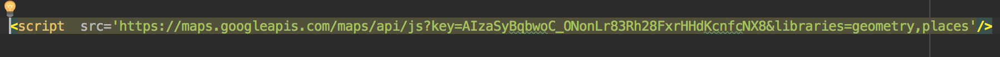
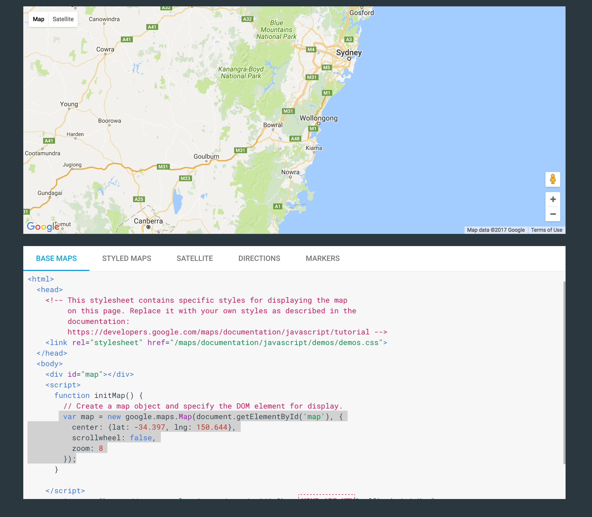
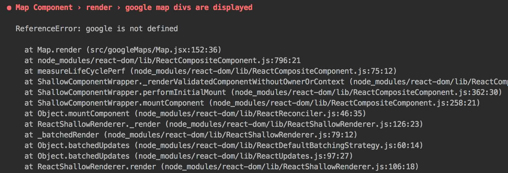
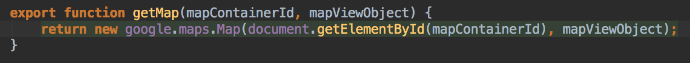
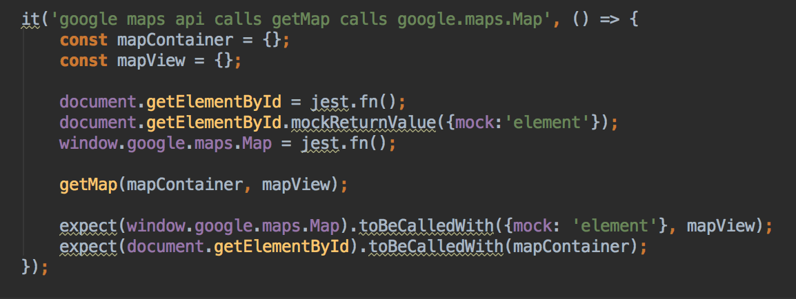
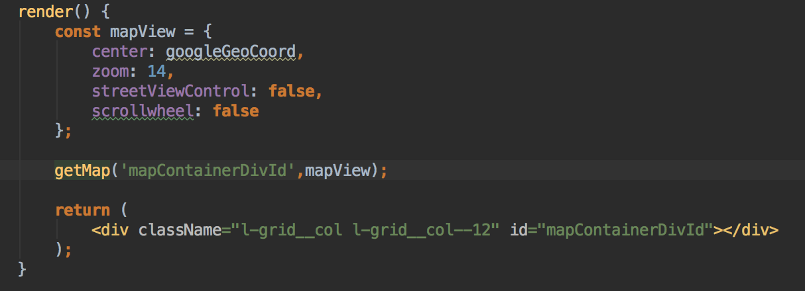
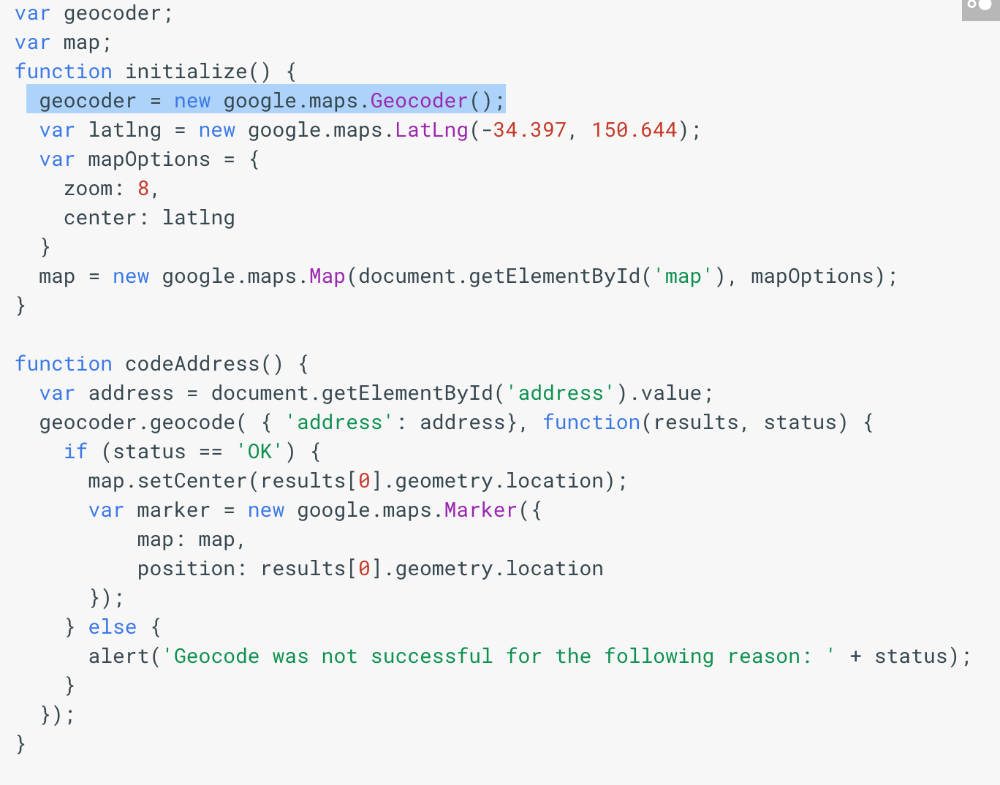
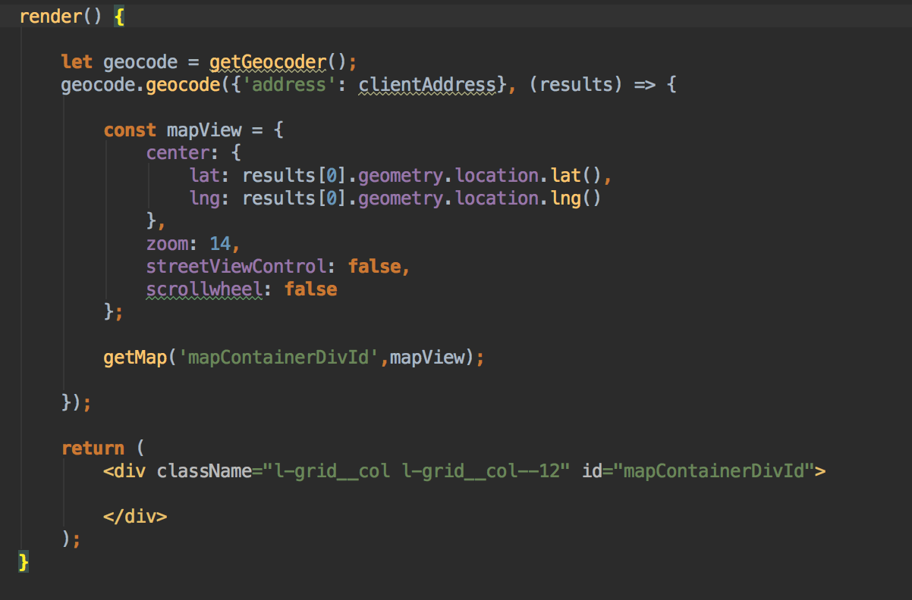
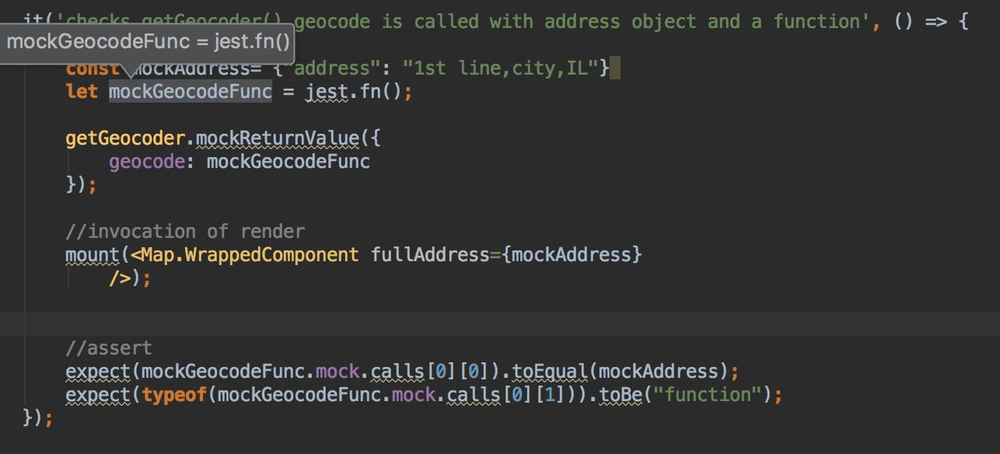
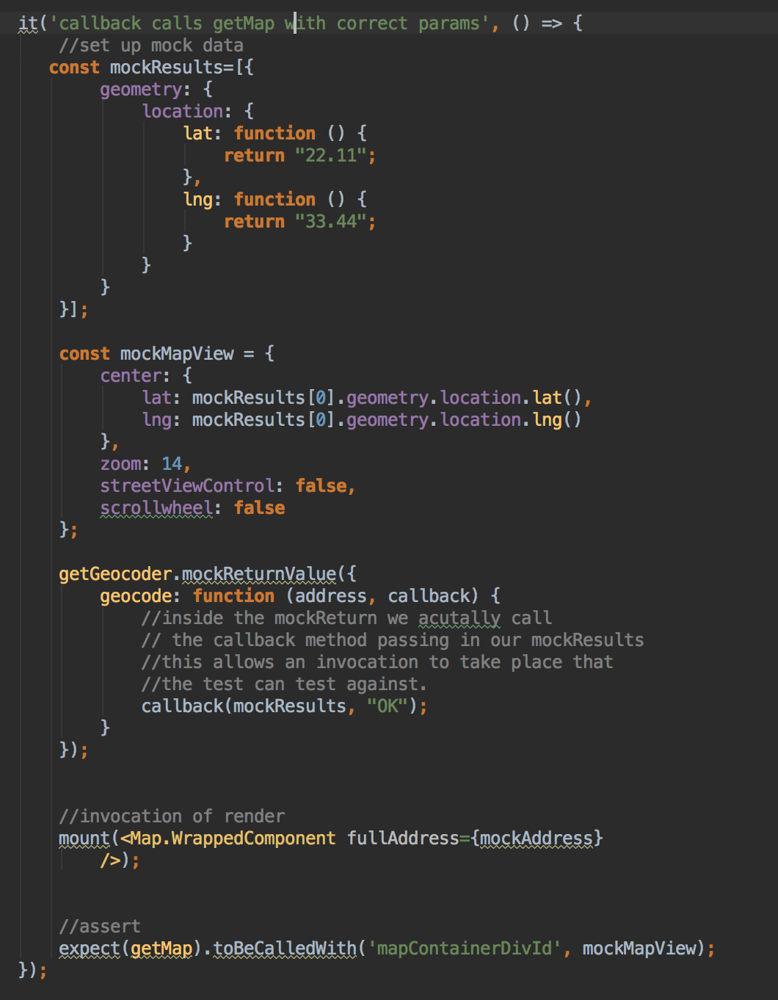

#HSLIDE
## A Brief info to Google Maps and How to Test it
 *By the end of this we should be able to have a map that plots addresses and can bring back a list of favorite places.
*With test coverage!

#HSLIDE

#HSLIDE
### Getting Started With Google Maps
* the first thing you need to do when doing google maps is to insert the script so that google will initialize. This is usually done in your index.js but it will be ok so long as it is inserted before the first call to google.

 

#HSLIDE
*To do a basic map you need a div with an id that the map can be inserted into. Normally the map code would look like this (ripped straight from google maps api tutorial)

*the problem with this is that when testing your javascript hasn’t been compiled and there for google.maps.Map has not been initialize and you will get an error.

#HSLIDE

#HSLIDE
### Enter a Service Wrapper
* In order to pass your test its best to wrap the google.maps in a service that’s only job is to serve up a brand new object. Taking in a divId and a map object.

#HSLIDE
### Our Code Now Looks like this

#HSLIDE
### GeocodeLocations and testing Callbacks
*When you have an address coming and you want to display it on your map. You must get the co-ordinates by calling that google service. See the problem?
* more calls to google.maps.Geocoder() that your tests won’t recognize.

#HSLIDE 
*We can easily put the google.maps.Geocoder() into our service and test the same way as before.
*Testing the geocode.geocode() Callback however is the most trouble

#HSLIDE Testing the callback 
*Theres two phases of testing the callback 
1.Making sure the invocation method is called with the correct parameters.
2. Testing what goes on inside in the callback
 
#HSLIDE
###Making sure the invocation method is called with the correct parameters.

#HSLIDE
###Testing inside the callback- this gets a little inception like...

#HSLIDE
### for more google maps testing and life cycle testing with react check out our project https://github.allstate.com/RelationshipPlatform/allstate-rp-app-intelligence or grab one of us and we’ll be happy to pair.